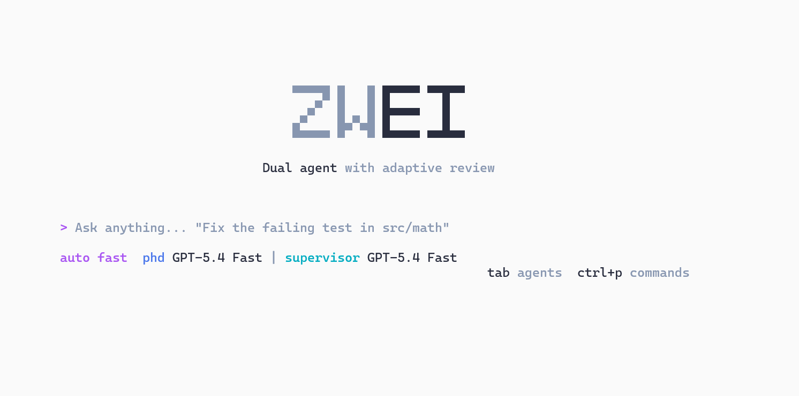

# Zwei CLI

<p align="right"><b>English</b> | <a href="./README.zh.md">简体中文</a></p>

> **Experimental** dual-agent coding tool. **PhD writes, Supervisor verifies.**
>
> A different take on how coding agents compose: two isolated minds, one codebase, asymmetric memory.
>
> Fork of [opencode](https://github.com/sst/opencode).
>
> _"Zwei" — German for "two"._

<p align="center"></p>

---

## Why

Most coding agents cram everything into a single context: read, write, run tests, grade, retry. As runs get longer, attention thins, test output drowns out intent, and the agent ends up grading its own homework.

Zwei borrows a pattern from academia: **PhD writes, Supervisor grades.** Two isolated sessions, two independent skill sets, one-way information flow at the boundary. The writer never peeks at the grader's reasoning — so it can't optimise against it.

## Core Ideas

- **Dual Attention** — two physically isolated sessions. The PhD focuses on writing; the Supervisor focuses on reviewing. Neither role burns attention on the other's job.
- **Independent Skills** — each role loads its own skill set. Nothing is shared by default — the PhD isn't distracted by review tooling, the Supervisor isn't tempted to reach in and edit.
- **Asymmetric Memory** — the PhD never sees the Supervisor's reasoning; only a structured verdict crosses the boundary. The Supervisor sees the PhD's code and test output. Memory flows one way, by design.
- **Write / Test Separation** — the PhD has no `bash` and no read access to tests. Self-verification is physically impossible, and the writer's context stays clean — no tool traces, no test output, no file dumps polluting it.

The combined effect: the writer can't Goodhart the grader, and neither context contaminates the other.

## Install

### From source

```bash
git clone https://github.com/ZweiAI/ZweiCli
cd ZweiCli
bun install
bun run --cwd packages/zwei dev --help
```

### From npm

```bash
npm install -g @zweicli/cli
zwei --help
```

Auto-update is on by default and tracks `@zweicli/cli@latest` on npm. To manually bump: `zwei upgrade`, or `npm install -g @zweicli/cli@latest`.

For everything outside the dual loop (auth, models, providers, sessions, web UI), upstream opencode conventions still apply. See [opencode.ai](https://opencode.ai).

## Usage

Start the TUI:

```bash
zwei
```

### Slash commands

Once inside the TUI, type `/` at the prompt. The commands that matter for the dual-agent workflow:

| Command | Does what |
|---|---|
| `/agents` (or `/agent`) | Pick mode × role. See the mode table below |
| `/model` | Change model for **both** PhD and Supervisor |
| `/model1` | Change model for **PhD only** (the writer) |
| `/model2` | Change model for **Supervisor only** (the grader) |
| `/clear` | Wipe conversation in all three sessions (you + PhD + Supervisor) |
| `/clear1` | Wipe PhD's session only |
| `/clear2` | Wipe Supervisor's session only |

### `/agents` — pick a mode

The agents dialog shows six options — the product of three **modes** and two **roles**:

| Mode | What it does | When to use |
|---|---|---|
| **`dual`** | Every round, PhD writes then Supervisor reviews. Supervisor always runs | Long tasks, strict review, anti-Goodhart eval settings |
| **`auto`** | PhD writes first. If a test gate passes, Supervisor is skipped; otherwise invoked | Default — saves tokens when writer nails it on the first round |
| **`single`** | PhD only, no Supervisor. Equivalent to upstream opencode's single-agent flow | Tasks a strong model can one-shot — no point paying for review |

The **role** suffix (`fast` vs `plan`) picks the agent variant:

- **`fast`** — execution mode; the agent actually edits and runs
- **`plan`** — planning mode; read-only, produces a plan document before switching to fast

So `dual fast` means "PhD + Supervisor, both in execution mode", `auto plan` means "PhD plans first, Supervisor checks the plan on demand", etc.

### Different models for PhD and Supervisor

The whole point of the asymmetric split is that the writer can be cheap and the grader strong (or vice versa):

```
/model1   # pick a fast / cheap model for PhD (e.g. Haiku 4.5)
/model2   # pick a strong / picky model for Supervisor (e.g. Opus 4.6)
```

Switching models works mid-run too — the change lands on the next round, not the current one.

## Status

Pre-1.0, experimental. Architecture and terminology may still shift. Issues and PRs are welcome — especially workload reports showing where dual wins or loses against single-agent baselines.

## License

MIT. See [LICENSE](./LICENSE) — the original opencode copyright is retained alongside ZweiAI's.
